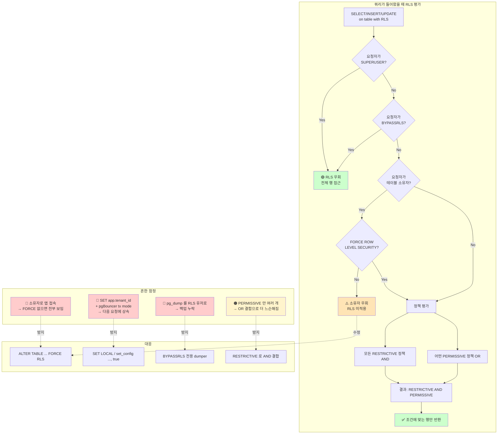

# E2. RLS 정책 함정 — 정책은 걸었는데 소유자는 그대로 본다

> **증상 박스**
> - RLS 를 활성화했는데 애플리케이션 유저에게만 빈 결과가 나온다
> - 슈퍼유저/소유자로 `\dt` 를 찍으면 데이터가 다 보인다
> - pgBouncer transaction mode 에서 다른 테넌트의 데이터가 간헐적으로 노출된다
> - `pg_dump` 를 떴더니 일부 행이 빠져 있다

---

## 증상

RLS(Row-Level Security) 는 같은 테이블에서 요청자에 따라 **보이는 행을 다르게 만드는** 기능이다. 멀티테넌트 SaaS, 감사 요건이 있는 시스템에서 널리 쓰인다. 하지만 기본 동작이 직관과 어긋나는 포인트가 많아 "걸었다고 생각했는데 안 걸려 있다" 는 사례가 잦다.

| 증상 | 의심되는 원인 |
|------|---------------|
| 일반 유저는 빈 결과, 소유자는 전체 데이터 | `FORCE ROW LEVEL SECURITY` 미설정 → 소유자가 정책을 우회 |
| pgBouncer 환경에서 간헐적으로 다른 테넌트 행이 보인다 | `SET` 으로 설정한 세션 변수가 세션 pool 로 다음 트랜잭션에 상속됨 |
| INSERT 는 되는데 해당 행이 안 보인다 | `USING` 은 설정했는데 `WITH CHECK` 가 없거나 반대 |
| `pg_dump` 결과에 행이 빠져 있다 | dump 실행 유저에 RLS 가 걸려 있음 |
| 정책을 여러 개 걸었는데 더 엄격해지지 않는다 | 여러 permissive 정책은 `OR` 로 결합되어 오히려 완화됨 |

---

## 실제 상황 — 타임라인

멀티테넌트 SaaS 에서 `orders` 테이블을 테넌트별로 분리하는 작업.

```
T+0   팀장: "다음 스프린트에 RLS 로 테넌트 격리 도입."
T+2h  엔지니어: ALTER TABLE orders ENABLE ROW LEVEL SECURITY;
               CREATE POLICY tenant_iso ON orders
                 USING (tenant_id = current_setting('app.tenant_id')::int);
T+2h  SUPERUSER 로 SELECT → 모든 테넌트 행이 보인다.
      "정책이 안 먹는 건가?" (사실은 슈퍼유저 우회가 정상)
T+4h  앱 유저로 set app.tenant_id=1; 후 → 테넌트 1 만 보임. 배포.
T+3d  CS: "A 고객이 B 고객 주문을 본 것 같아요."
      pgBouncer transaction pooling 에서 이전 트랜잭션의
      SET app.tenant_id=7 이 세션에 남아 다음 요청(tenant_id=3) 이
      tenant_id=7 로 조회됨.
T+3d  긴급 패치: SET LOCAL + FORCE ROW LEVEL SECURITY 추가
      + pg_dump 스크립트에 --no-row-security.
```

---

## 원인 분석

### 1) RLS 기본 동작

```sql
-- 1단계: RLS 를 테이블에 활성화
ALTER TABLE orders ENABLE ROW LEVEL SECURITY;

-- 2단계: 정책을 만든다 (정책이 하나도 없으면 모든 행이 막힌다)
CREATE POLICY tenant_iso ON orders
  FOR ALL                       -- SELECT/INSERT/UPDATE/DELETE 전체
  USING (tenant_id = current_setting('app.tenant_id')::int)   -- 읽기/UPDATE 대상
  WITH CHECK (tenant_id = current_setting('app.tenant_id')::int); -- 쓰기 제약
```

포인트:

- `ENABLE ROW LEVEL SECURITY` 만 하고 정책을 안 만들면 **아무 행도 안 보인다** (deny-by-default).
- `USING` 은 "이 행을 볼 수 있는지" (SELECT, UPDATE 의 대상 선정, DELETE).
- `WITH CHECK` 는 "이 행을 쓸 수 있는지" (INSERT 및 UPDATE 후 결과).
- `USING` 만 있고 `WITH CHECK` 가 없으면 INSERT 시 기본값으로 `USING` 과 같은 조건이 쓰인다. 하지만 UPDATE 는 기존 행이 `USING` 에 부합하면 무조건 통과하므로, **쓰기를 강하게 막으려면 `WITH CHECK` 를 명시**해야 한다.

### 2) 소유자는 기본적으로 RLS 를 우회한다

```sql
-- 테이블 소유자인 app_owner 로 접속
SET ROLE app_owner;
SELECT * FROM orders;   -- RLS 정책 무시, 전체 행 반환
```

PostgreSQL 은 설계상 테이블 소유자와 슈퍼유저를 RLS에서 기본 제외한다. "유지보수자가 자기 데이터를 못 보면 곤란" 이라는 철학. 그러나 앱 서버가 소유자 역할로 접속하거나 감사 범위에 소유자가 포함되는 경우엔 치명적이다.

해결은 한 줄:

```sql
ALTER TABLE orders FORCE ROW LEVEL SECURITY;
```

`FORCE` 가 붙으면 소유자에게도 정책이 적용된다 (단, 슈퍼유저와 `BYPASSRLS` 속성 역할은 여전히 우회).

### 3) 여러 정책은 OR 로 결합된다 (permissive 기본)

```sql
CREATE POLICY p1 ON orders FOR SELECT USING (tenant_id = current_setting('app.tenant_id')::int);
CREATE POLICY p2 ON orders FOR SELECT USING (owner_id = current_setting('app.user_id')::int);
```

이 두 정책이 있으면 어느 한쪽이라도 `true` 면 행이 보인다 (OR). 더 엄격하게 하려면 `RESTRICTIVE` 로 명시해야 한다.

```sql
CREATE POLICY p_restrict_region ON orders
  AS RESTRICTIVE                       -- 기본은 PERMISSIVE
  FOR SELECT
  USING (region = current_setting('app.region'));
```

평가 규칙: `(모든 RESTRICTIVE 가 true) AND (어떤 PERMISSIVE 가 true)`.

### 4) pgBouncer transaction mode 와 `SET` 의 함정

```
   App          pgBouncer (tx mode)        Postgres backend #7
   ----         ---------------------      -------------------
   BEGIN
   SET app.tenant_id=1      ──────>   (conn A 할당)  SET app.tenant_id=1
   SELECT ...
   COMMIT                   ──────>   (conn A 반환)  ← app.tenant_id=1 남음

   --- 다른 요청, tenant_id=3 으로 들어옴 ---
   BEGIN                    ──────>   (conn A 재할당)  ← app.tenant_id=1 그대로!
   SELECT * FROM orders     ──────>   tenant_id=1 로 조회됨 😱
```

`SET` 은 **세션 수준**으로 지속되므로 pgBouncer 가 풀로 돌려쓰는 커넥션에 이전 값이 남는다. 멀티테넌트에서 이것이 곧 **데이터 누출**이다.

해결:
- `SET LOCAL` 은 트랜잭션 종료 시 자동 리셋 → 안전
- `set_config('app.tenant_id', '1', true)` 의 세 번째 인자 `is_local=true` 도 같은 효과

```sql
BEGIN;
SELECT set_config('app.tenant_id', '1', true);  -- 또는 SET LOCAL
SELECT * FROM orders;
COMMIT;
-- 다음 트랜잭션에선 app.tenant_id 가 비어 있음. 정책 평가 시 에러 → 안전 실패.
```

세션 pool 문제의 원인 해설은 [D1. Connection exhaustion](D1_connection_exhaustion.md) 의 pgBouncer 섹션과 함께 읽으면 좋다.

### 5) `SECURITY DEFINER` 함수와 RLS

`SECURITY DEFINER` 함수는 정의한 유저의 권한으로 실행된다. 이 유저가 테이블 소유자이고 `FORCE RLS` 가 없다면, 함수 호출 시 RLS 가 우회된다.

```sql
CREATE FUNCTION admin_count(tid int) RETURNS int
LANGUAGE sql
SECURITY DEFINER
AS $$ SELECT count(*) FROM orders WHERE tenant_id = tid $$;
-- 호출자가 일반 유저여도 orders 전체에 접근 가능 (위험)
```

이런 함수는 반드시 `SET search_path`, 입력 검증, 그리고 `FORCE ROW LEVEL SECURITY` 가 걸려 있는 전제에서만 사용해야 한다.

### 6) `pg_dump` 와 RLS

`pg_dump` 를 RLS 가 걸린 유저로 실행하면 정책에 맞는 행만 dump 된다. 백업이 조용히 손상되는 셈이다.

```bash
pg_dump -U app_api mydb > backup.sql                    # 위험: RLS 로 일부 행 누락
pg_dump --no-row-security -U dump_user mydb > bk.sql    # 안전 1: PG12+ 옵션
# 안전 2: BYPASSRLS 속성 유저로 실행
ALTER ROLE dump_user BYPASSRLS;
pg_dump -U dump_user mydb > bk.sql
```

---

## 진단 쿼리

### 1) 테이블의 RLS 상태

```sql
SELECT
    c.relname                        AS table_name,
    c.relrowsecurity                 AS rls_enabled,
    c.relforcerowsecurity            AS rls_forced
FROM pg_class c
JOIN pg_namespace n ON n.oid = c.relnamespace
WHERE n.nspname = 'public' AND c.relkind = 'r'
ORDER BY c.relname;
```

`rls_enabled = t` 여도 `rls_forced = f` 이면 소유자는 우회 가능.

### 2) 정책 목록

```sql
SELECT
    schemaname, tablename, policyname,
    permissive,                      -- PERMISSIVE / RESTRICTIVE
    roles,                           -- 어느 역할에 적용되는가
    cmd,                             -- ALL / SELECT / INSERT / UPDATE / DELETE
    qual           AS using_expr,    -- USING 조건
    with_check     AS with_check_expr
FROM pg_policies
WHERE schemaname = 'public'
ORDER BY tablename, policyname;
```

psql 에서는 `\d+ orders` 하단에도 정책이 표시된다.

### 3) 특정 유저 관점에서 테스트

```sql
-- 슈퍼유저에서
SET ROLE app_api;
SET LOCAL app.tenant_id = '1';
EXPLAIN (ANALYZE, VERBOSE) SELECT * FROM orders LIMIT 10;
-- 계획에 "Filter: (tenant_id = ...)" 형태로 정책이 나타난다
RESET ROLE;
```

### 4) BYPASSRLS 역할 및 세션 설정 확인

```sql
-- 감사 관점에서 BYPASSRLS 를 가진 역할 목록은 최소화되어야 한다
SELECT rolname, rolsuper, rolbypassrls
FROM pg_roles WHERE rolsuper OR rolbypassrls ORDER BY rolname;

-- 현재 세션의 app.* 설정값
SELECT name, setting, source FROM pg_settings WHERE name LIKE 'app.%';
SELECT current_setting('app.tenant_id', true);   -- 없으면 NULL (에러 아님)
```

---

## 해결

### 즉시 — 소유자 우회 차단 및 세션 변수 스코프 수정

```sql
-- 1) 소유자도 정책을 따르도록
ALTER TABLE orders FORCE ROW LEVEL SECURITY;

-- 2) 애플리케이션은 SET LOCAL 로 변수 설정 (반드시)
BEGIN;
SET LOCAL app.tenant_id = '1';     -- 또는 set_config(..., true)
SELECT * FROM orders WHERE ...;
COMMIT;
```

애플리케이션 프레임워크의 커넥션 훅에서 매 트랜잭션 시작 시 `SET LOCAL` 을 보장해야 한다.

### 단기 — 정책 정비

```sql
-- SELECT 와 INSERT/UPDATE/DELETE 를 분리해서 USING / WITH CHECK 명확히
DROP POLICY IF EXISTS tenant_iso ON orders;

CREATE POLICY tenant_select ON orders FOR SELECT
  USING (tenant_id = current_setting('app.tenant_id')::int);

CREATE POLICY tenant_insert ON orders FOR INSERT
  WITH CHECK (tenant_id = current_setting('app.tenant_id')::int);

CREATE POLICY tenant_update ON orders FOR UPDATE
  USING     (tenant_id = current_setting('app.tenant_id')::int)
  WITH CHECK(tenant_id = current_setting('app.tenant_id')::int);

CREATE POLICY tenant_delete ON orders FOR DELETE
  USING (tenant_id = current_setting('app.tenant_id')::int);

-- 더 엄격하게 AND 결합이 필요하면 RESTRICTIVE
CREATE POLICY tenant_region ON orders AS RESTRICTIVE FOR ALL
  USING (region = current_setting('app.region'));
```

### 근본 — 운영 레벨 방어선

```sql
-- 1) 덤프/복제 등 관리 작업 전용 역할은 BYPASSRLS 지정
CREATE ROLE rls_dumper LOGIN BYPASSRLS PASSWORD '...';
-- pg_dump 는 이 역할로 수행

-- 2) 애플리케이션은 테이블 소유자로 접속하지 않는다
--    owner 는 DDL 전용, api 는 별도 역할로 INHERIT 조합

-- 3) 테이블 생성 시 기본으로 RLS + FORCE 를 켜는 마이그레이션 템플릿
CREATE TABLE accounts (...);
ALTER TABLE accounts ENABLE ROW LEVEL SECURITY;
ALTER TABLE accounts FORCE ROW LEVEL SECURITY;
-- 정책 없으면 deny-by-default 로 안전 측 실패
```

### pg_dump 안전하게

```bash
# 옵션 1: --no-row-security (PG12+)
pg_dump --no-row-security -U dump_user -d mydb > backup.sql

# 옵션 2: BYPASSRLS 유저
pg_dump -U rls_dumper -d mydb > backup.sql

# 옵션 3: 슈퍼유저 (관리형 DB 에선 보통 불가)
```

백업 스크립트에 옵션 누락 여부를 테스트에 포함해야 한다 (행 수가 예상과 다르면 경고).

---

## 예방

```
체크리스트:

  1. RLS 를 쓰면 반드시 FORCE ROW LEVEL SECURITY 세트로 켠다
       - 소유자 우회는 "기능" 이지만, 멀티테넌트에선 버그다

  2. USING 과 WITH CHECK 를 항상 둘 다 명시
       - INSERT, UPDATE 에서 어떤 행을 쓸 수 있는지 분리

  3. 세션 변수 기반 정책 + Pooler 조합은 SET LOCAL 만 쓴다
       - 애플리케이션 미들웨어에서 BEGIN 직후 자동 삽입
       - 코드리뷰 체크리스트에 포함

  4. pg_dump / ETL 전용 역할은 BYPASSRLS
       - 백업 누락은 조용히 일어난다, 행 수 모니터링 필수

  5. 여러 정책을 쓸 때 PERMISSIVE vs RESTRICTIVE 혼동 주의
       - PERMISSIVE 는 OR, 더 허용적
       - RESTRICTIVE 는 AND, 더 엄격

  6. 정책 테스트 자동화
       - CI 에서 "tenant_id=1 로 접속했을 때 tenant_id=2 행이 안 보이는가"
       - 새 마이그레이션마다 재실행

  7. SECURITY DEFINER 함수는 최소화
       - 쓸 수밖에 없다면 SET search_path, 입력 검증, 소유자도 RLS 적용
```

---

## Mermaid — RLS 평가 흐름과 함정



---

## 관련 챕터 · 치트시트 · 케이스

- [2장. PostgreSQL 아키텍처](../chapters/ch02_architecture.md) — 역할과 스키마 구조
- [7장. 트랜잭션과 격리 수준](../chapters/ch07_transactions_isolation.md) — `SET LOCAL` 의 범위
- [E1. 권한 오류](E1_permission_errors.md) — 객체 수준 권한 문제와 비교
- [D1. Connection Exhaustion](D1_connection_exhaustion.md) — pgBouncer transaction mode 동작 원리
- [cheatsheets/psql_commands.md](../cheatsheets/psql_commands.md) — `\d+`, `\dp` 로 정책 확인

### 공식 문서

- [Row Security Policies](https://www.postgresql.org/docs/current/ddl-rowsecurity.html)
- [CREATE POLICY](https://www.postgresql.org/docs/current/sql-createpolicy.html)
- [pg_dump — `--no-row-security`](https://www.postgresql.org/docs/current/app-pgdump.html)
