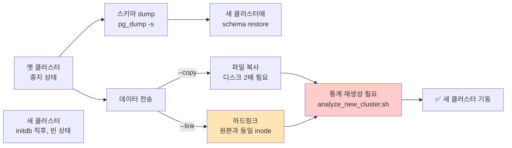
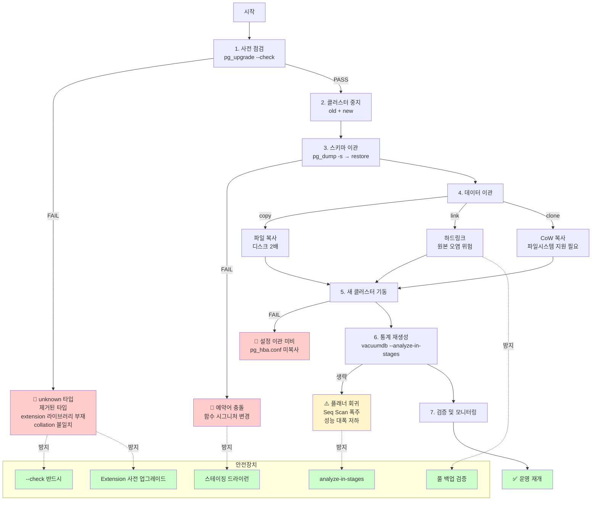

# F1. pg_upgrade 흔한 실패 — 메이저 업그레이드 직전에 터지는 것들

> **증상 박스**
> - `pg_upgrade` 실행 도중 `Checking for incompatible "unknown" data type ... fatal`
> - `Could not find matching subscriptions/extensions` 에러로 중단
> - 업그레이드는 성공했는데 배포 후 쿼리가 전부 느려졌다 (ANALYZE 누락)
> - `--link` 모드로 실패한 뒤 원본 클러스터도 기동이 수상해졌다

---

## 증상

PostgreSQL 의 메이저 업그레이드는 보통 세 가지 방식 중 하나를 고른다.

| 방식 | 다운타임 | 난이도 | 특징 |
|------|----------|--------|------|
| `pg_dumpall` + `pg_restore` | 큰 테이블이면 매우 김 | 낮음 | 단순, 가장 안전, 대용량엔 비실용 |
| `pg_upgrade` (`--copy` / `--link`) | 수 분~수십 분 | 중 | 표준, 링크 모드는 빠르지만 롤백 제한 |
| Logical replication 기반 (pglogical, 내장 pub/sub) | 거의 0 | 높음 | 무중단 가능, 준비가 많음 |

대부분 사이트는 `pg_upgrade` 를 쓴다. 가장 많이 터지는 실패 패턴은 아래와 같다.

```
$ pg_upgrade --old-bindir=... --new-bindir=... \
             --old-datadir=... --new-datadir=... --link --jobs=4

Performing Consistency Checks
-----------------------------
Checking for incompatible "unknown" data type                 fatal

Your installation contains the "unknown" data type in user tables.
This data type is no longer allowed in tables, so this cluster
cannot currently be upgraded.

--- 또는 ---
Checking for presence of required libraries                   fatal
  plpgsql.so / pg_stat_statements.so / postgis-2.5.so
```

또는 업그레이드는 성공했는데 배포 후 평소 20ms 쿼리가 2초로 급증. `pg_stat_activity` 에 대기 없음. 원인은 통계 정보(`pg_statistic`) 가 비어 있어 플래너가 엉뚱한 계획을 택하는 것.

---

## 실제 상황 — 타임라인

금요일 밤, PG14 → PG16 업그레이드.

```
21:00  사전 점검 없이 --check 단계 생략.
       "스테이징에선 잘 됐으니 바로 간다."

21:05  pg_upgrade --link 시작.

21:08  FAIL: "Your installation contains the 'unknown' data type..."
       14 년 전 만든 뷰 한 개가 SELECT 'hello' 로 컬럼을 만들어
       unknown 타입 컬럼이 스키마에 남아 있었다.

21:25  해당 뷰 수정, 다시 시도.

21:30  FAIL: "missing library postgis-2.5"
       스테이징은 15 에 postgis 3.x 를 쓰는데
       프로덕션 14 는 2.5 였다. 16 엔 3.x 만 있다.

22:10  postgis 를 미리 3.x 로 올리는 절차를 역으로 수행.

22:40  pg_upgrade 성공. 서비스 기동.

22:45  사용자 보고: "대시보드가 10초 이상 걸려요."
       EXPLAIN 을 보니 Seq Scan 이 가득.
       → ANALYZE 미실행. pg_upgrade 는 통계를 가져오지 않는다.

22:50  vacuumdb --all --analyze-in-stages 실행.
       3분 뒤 빠른 통계가 들어가 급한 쿼리는 정상화.
       전체 ANALYZE 완료는 20분 뒤.
```

"업그레이드 자체는 빨랐지만 준비 부족으로 1시간 30분짜리 장애가 됐다."

---

## 원인 분석

### 1) pg_upgrade 의 동작



핵심 사실:

- `pg_upgrade` 는 **스키마만 dump/restore** 하고, **데이터는 파일 그대로 가져간다**.
- 그 전에 `--check` 단계에서 호환성 검사를 한다.
- 통계(`pg_statistic`) 는 이전되지 않는다. 업그레이드 후 `ANALYZE` 필수.

### 2) `--link` 모드의 트레이드오프

| 모드 | 장점 | 단점 |
|------|------|------|
| `--copy` | 원본 보존 → 실패 시 즉시 롤백 | 디스크 2배, 시간 김 |
| `--link` | 시간 최소, 공간 추가 불필요 | 새 클러스터가 파일을 수정하면 원본도 오염 → 롤백 불가 |
| `--clone` (지원 파일시스템) | CoW 로 복사 속도에 원본 보존 | XFS reflink / Btrfs / APFS 등 필요 |

`--link` 로 실패하면 파일이 이미 new datadir 쪽에 하드링크되어 있어 다시 old 로 돌리는 건 안전하지 않다. 반드시 **사전 풀 백업** 이 있어야 한다.

### 3) 흔한 차단 요인

| 카테고리 | 구체적 사례 |
|----------|-------------|
| 호환 불가 타입 | `unknown` 타입 컬럼 (뷰에서 문자열 리터럴이 만든 컬럼), 제거된 타입 (`abstime`, `reltime` 는 PG12 제거) |
| Extension 라이브러리 | PostGIS 2.5 → 3.x 전이, pg_stat_statements 버전, 자체 빌드한 .so 파일 미설치 |
| Collation 변경 | PG15 기본 ICU, PG17 `C.UTF-8` built-in → 인덱스 `REINDEX` 필요할 수 있음 |
| Logical replication | publication/subscription 상태 이월 제약 |
| TOAST / 복잡 타입 | 일부 composite / range 타입의 바이너리 호환성 |
| 예약어 | 새 버전에서 예약어가 된 식별자 (따옴표 없이 쓴 컬럼명) |

### 4) v14 → v15 → v16 → v17 주요 변경점

```
PG15  public 스키마 기본 CREATE 권한 제거(E1 참조), MERGE 구문 도입, ICU collation 강화
PG16  Logical replication 성능 개선, 시스템 뷰 컬럼 변경, pg_stat_io 추가
PG17  built-in C.UTF-8, Vacuum TID store 개선, MERGE RETURNING, --copy-file-range
```

마이너 변경이라도 **extension 의 의존 함수/시스템 뷰를 참조**하는 경우 빌드가 안 맞아 업그레이드 중 실패할 수 있다.

### 5) 통계 누락으로 인한 성능 회귀

`pg_upgrade` 가 끝난 직후 `pg_statistic` 는 비어 있다. 플래너는 단순 추정(기본 페이지 수·평균 비용)만으로 계획을 짜고, 결과는 대개 Seq Scan 범벅이다. B1/B5 계열 문제가 업그레이드 직후 한꺼번에 터진다.

공식적으로는 업그레이드가 끝날 때 `analyze_new_cluster.sh` 가 생성된다. 이걸 실행해야 한다. 더 권장되는 방법은 `vacuumdb --all --analyze-in-stages`: 통계를 3단계로 쌓아 급한 쿼리부터 빠르게 계획이 살아난다.

---

## 진단 쿼리

### 1) 업그레이드 전 — 사전 점검

```bash
# 가장 먼저 해야 할 것: --check 단독 실행
pg_upgrade --old-bindir=... --new-bindir=... \
           --old-datadir=... --new-datadir=... --check

# 결과 로그는 pg_upgrade_output.d/<timestamp>/ 아래 (PG15+).
# 모든 FAIL 을 먼저 해결.
```

### 2) unknown/제거 타입 컬럼 찾기

```sql
-- unknown 타입 컬럼이 있는 관계
SELECT n.nspname, c.relname, a.attname, t.typname
FROM pg_attribute a
JOIN pg_class c     ON c.oid = a.attrelid
JOIN pg_namespace n ON n.oid = c.relnamespace
JOIN pg_type t      ON t.oid = a.atttypid
WHERE t.typname = 'unknown'
  AND a.attnum > 0 AND NOT a.attisdropped;
```

### 3) 양쪽 클러스터의 extension 비교

```sql
-- 현재 사용 중
SELECT extname, extversion FROM pg_extension ORDER BY extname;

-- 새 버전에 설치 가능한 버전 (새 클러스터에 접속해서)
SELECT name, default_version, installed_version
FROM pg_available_extensions
WHERE name IN ('postgis','pg_stat_statements','pg_repack','pg_cron','pg_hint_plan','plv8')
ORDER BY name;
```

### 4) Publication / Subscription 상태

```sql
SELECT * FROM pg_publication;
SELECT * FROM pg_subscription;
SELECT * FROM pg_replication_slots;   -- logical replication slot 들
```

Replication 구성이 복잡하면 `pg_upgrade` 는 slot 을 그대로 옮기지 않는다. 별도 계획 필요.

### 5) 커스텀 함수/뷰에서 변경될 가능성

```sql
-- 현재 cluster 의 deprecated 기능 사용 검사 (버전 릴리스 노트와 교차)
-- 예: PG14 에서 PG15 로 갈 때 제거된 기능 사용
-- 단서: 실행 중 경고 로그, 릴리스 노트의 "Deprecated" 섹션
```

### 6) 업그레이드 후 — 상태 점검

```sql
-- 통계가 채워졌는가
SELECT relname,
       last_analyze, last_autoanalyze,
       n_live_tup, n_dead_tup
FROM pg_stat_user_tables
ORDER BY coalesce(last_analyze, '1970-01-01') ASC
LIMIT 20;

-- 버전 확인
SELECT version();
SHOW server_version_num;

-- 시스템 카탈로그 무결성 (예: extension 로드 실패)
SELECT extname, extversion, extconfig, extcondition FROM pg_extension;
```

---

## 해결

### 업그레이드 실행 전 체크리스트

```
사전 점검 (최소 1주 전):
  1. 릴리스 노트 정독 — 각 중간 버전의 "Migration to version X" 섹션(기본값/제거/예약어/호환성)
  2. pg_upgrade --check 를 프로덕션 사본에서 드라이런, 모든 FAIL 해결
  3. Extension 정비 — 동일/호환 버전 설치, PostGIS 는 현재를 2.x→3.x 선승격, 자가 .so 복사
  4. 로케일/collation (PG15+) — ICU 전환 여부, locale 인덱스 REINDEX 필요성
  5. 전체 백업 (필수) — pgBackRest/WAL-G full + WAL, 복구 테스트까지 검증된 것
  6. 다운타임 윈도우와 롤백 플랜 — --link 는 백업 롤백만 가능, 기준 시각/손실 허용량 문서화
```

### 업그레이드 실행

```bash
# 1) 양쪽 클러스터 모두 정지
systemctl stop postgresql@14-main
systemctl stop postgresql@16-main

# 2) 새 클러스터가 initdb 되어 있어야 한다
#    필요 시 locale / encoding 을 기존과 동일하게
pg_createcluster 16 main --start-conf=manual \
  --locale=en_US.UTF-8 --encoding=UTF8

# 3) --check 먼저 / 4) 본격 실행 (--link 또는 --copy)
PGUP="pg_upgrade \
  --old-bindir=/usr/lib/postgresql/14/bin \
  --new-bindir=/usr/lib/postgresql/16/bin \
  --old-datadir=/var/lib/postgresql/14/main \
  --new-datadir=/var/lib/postgresql/16/main \
  --jobs=$(nproc)"
$PGUP --check
$PGUP --link

# 5) 설정파일 이관
#    postgresql.conf, pg_hba.conf 는 새 datadir 에 맞춰 수정 or 이식

# 6) 새 클러스터 기동
systemctl start postgresql@16-main

# 7) 통계 재생성 (가장 중요, 즉시)
#    analyze_new_cluster.sh 보다 이것을 권장
vacuumdb --all --analyze-in-stages --jobs=$(nproc)

# 8) 모니터링
#    쿼리 지연, pg_stat_statements, 에러 로그
```

### 업그레이드 후 할 일

```sql
-- 1) 각 DB 에서 extension 최신화 필요 여부
\c mydb
ALTER EXTENSION postgis UPDATE;
ALTER EXTENSION pg_stat_statements UPDATE;

-- 2) 인덱스 재정렬이 필요한 경우 (collation 변경 등)
REINDEX DATABASE CONCURRENTLY mydb;   -- 시간 여유 있을 때

-- 3) 통계 수동 보강 (분포가 편향된 테이블은 target 상향)
ALTER TABLE big_table ALTER COLUMN user_id SET STATISTICS 1000;
ANALYZE big_table;

-- 4) 옛 클러스터 데이터 디렉토리 정리 (--link 였다면
--    새 클러스터가 안정화된 뒤)
# pg_upgrade 가 만들어둔 스크립트:
#   delete_old_cluster.sh  ← --link 모드 전용
```

`--link` 로 업그레이드한 직후 **즉시** `delete_old_cluster.sh` 를 돌리면 안 된다. 며칠 모니터링 후 안정화 확인 뒤에 삭제.

### 실패 시 롤백

```
--copy 로 했다면: 새 클러스터 중지 → 옛 클러스터 기동(datadir 그대로) → 서비스 원복
--link 로 실패:   새 클러스터 중지 → 백업에서 복구(원본 datadir 신뢰 불가)
                → WAL 재적용 → 원인 해결 후 재시도
Logical replication: subscription 중지 → 앱을 기존 클러스터로 되돌림 → 새 클러스터 재구성
```

---

## 예방

```
체크리스트:
  1. 업그레이드는 "이벤트" 로 취급 — 사전 점검 → 스테이징 드라이런 → 백업 → 실행 → 검증.
     절대 --check 생략하지 않는다.
  2. 프로덕션과 동일한 extension 세트(자체 빌드 .so 포함)를 스테이징에 유지.
  3. Extension 은 업그레이드 "전에" 호환 버전으로 (PostGIS 같은 덩치는 여유 있게 선행).
  4. --link 쓰면 반드시 full backup 검증 완료 후 — 시간 단축의 대가는 "롤백 옵션 축소".
  5. 업그레이드 직후 vacuumdb --analyze-in-stages 는 필수 — 가장 흔한 직후 장애 원인.
  6. TB 단위 + 다운타임 허용치 낮음 → Logical replication 업그레이드 검토.
  7. 매 버전의 "Compatibility with Previous Releases" 정독 — 누적 변경이 장애를 만든다.
```

---

## Mermaid — pg_upgrade 단계별 흐름과 실패 지점



---

## 관련 챕터 · 치트시트 · 케이스

- [11장. Backup 과 복구](../chapters/ch11_backup_recovery.md) — 업그레이드 전 백업 전략
- [10장. Replication](../chapters/ch10_replication.md) — logical replication 기반 업그레이드
- [cheatsheets/version_history.md](../cheatsheets/version_history.md) — 버전별 주요 변경점
- [cheatsheets/backup_recovery_recipes.md](../cheatsheets/backup_recovery_recipes.md) — pgBackRest/WAL-G 레시피
- [B1. Missing Index](B1_missing_index.md) — 업그레이드 직후 통계 누락과 함께 터지는 패턴
- [F2. 관리형 PG 제약](F2_managed_pg_limitations.md) — RDS/Cloud SQL 의 업그레이드 방식 차이

### 공식 문서

- [pg_upgrade](https://www.postgresql.org/docs/current/pgupgrade.html)
- [Release Notes — Migration Guides](https://www.postgresql.org/docs/current/release.html)
- [vacuumdb](https://www.postgresql.org/docs/current/app-vacuumdb.html)
