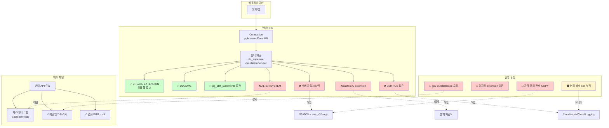

# F2. 관리형 PostgreSQL 제약 — RDS/Aurora/Cloud SQL 에서 안 되는 것들

> **증상 박스**
> - `ERROR: must be owner of relation pg_stat_statements` — 슈퍼유저가 아니라서 초기화 불가
> - `CREATE EXTENSION pg_cron` 이 실패, 지원 목록에 없다고 한다
> - `COPY ... FROM '/tmp/data.csv'` 가 permission denied
> - 특정 파라미터를 `ALTER SYSTEM SET` 으로 못 바꾼다
> - RDS gp2 디스크의 Burst Balance 가 0 으로 떨어지면서 IOPS 가 급락

---

## 증상

관리형 PostgreSQL(AWS RDS/Aurora, Google Cloud SQL/AlloyDB, Azure Database for PostgreSQL 등)은 운영 편의 대신 **SUPERUSER 와 호스트 접근을 포기**한 모델이다. 자가 관리(self-managed) PG 에서 당연히 되던 동작이 갑자기 안 될 때가 많다.

| 자가 관리에선 | 관리형에서 |
|---------------|-----------|
| `SUPERUSER` 로 무엇이든 | `rds_superuser` / `cloudsqlsuperuser` 로 **일부** 만 |
| `COPY FROM '/path/file'` | 파일시스템 접근 없음 → 실패 |
| `CREATE EXTENSION anything` | 벤더가 검증한 목록만 설치 가능 |
| `ALTER SYSTEM SET ...` | 파라미터 그룹 / flags 로만 변경 |
| SSH 로 로그·코어 확인 | CloudWatch / Stackdriver / Azure Monitor 로 간접 |
| `pg_read_file`, `pg_ls_dir` | 제한 또는 불가 |
| Trigger 기반 논리복제 소스 | 일부만 지원, `rds.logical_replication` 활성 필요 |

실제 실패는 이런 식이다.

```
SELECT pg_stat_statements_reset();
ERROR:  permission denied for function pg_stat_statements_reset
-- 벤더마다 필요한 특권 역할/래퍼가 다르다

COPY events FROM '/var/tmp/events.csv' CSV;
ERROR:  could not open file "/var/tmp/events.csv": Permission denied
-- 해결: 클라이언트 psql 에서 \copy 또는 aws_s3 extension

CREATE EXTENSION pg_cron;
ERROR:  extension "pg_cron" is not allow-listed for "rdsadmin" users
```

---

## 실제 상황 — 타임라인

자가 관리 PG 에서 1년 운영한 서비스를 AWS RDS PostgreSQL 로 이관하는 작업.

```
D-14  스테이징(self-managed) 에서 pg_cron / pg_hint_plan / COPY FROM PROGRAM 사용 중.
D-7   RDS 이관 POC.
       - pg_cron: RDS 16+ 지원(파라미터 그룹 활성)
       - pg_hint_plan: RDS 미지원 → 대안 탐색
       - COPY FROM PROGRAM: 불가 → aws_s3 extension 으로 대체
       - pg_repack: 지원
D-3   스토리지: 400GB 로 gp3 + IOPS 12,000 프로비저닝(예상 피크 9,000)으로 결정.
D-0   컷오버 후 1시간 뒤 장애. 확인해보니 실제 생성은 gp2 였다.
       gp2 는 볼륨 크기 비례 baseline + 크레딧 burst. 컷오버 직후 burst 고갈
       → baseline 1,200 IOPS 로 추락 → 앱 응답시간 급등.
D-0   gp3 로 변경(무중단이나 수 시간). 사이엔 워크로드 축소로 버팀.
```

"관리형이라 운영은 편해졌는데, 평가 단계에서 놓친 한두 가지가 장애로 그대로 왔다."

---

## 원인 분석

### 1) SUPERUSER 가 없다

관리형 PG 에서 `SUPERUSER` 는 벤더가 내부 유지보수용으로 갖는다. 사용자에게는 유사 역할만 제공된다.

| 벤더 | 특권 역할 | 제공되는 것 | 제공되지 않는 것 |
|------|-----------|-------------|------------------|
| AWS RDS | `rds_superuser` | `CREATE EXTENSION` (허용 목록 내), `pg_stat_statements_reset`, 로그 파일 읽기 | 파일시스템, `ALTER SYSTEM`, C 함수, 서버 프로세스 조작 |
| AWS Aurora PG | `rds_superuser` | 위와 동일 + Aurora 전용 함수 | 위와 동일 |
| GCP Cloud SQL | `cloudsqlsuperuser` | 유사한 수준 | SSH/OS, `ALTER SYSTEM` |
| GCP AlloyDB | `alloydbsuperuser` | 유사 + 컬럼 엔진 기능 | 위와 유사 |
| Azure Flexible Server | `azure_pg_admin` | `ALTER SYSTEM` 일부 허용 | 여전히 OS 접근 없음 |

이 때문에:
- 기본이 superuser 인 함수/extension 설치가 벤더 지원 여부에 전적으로 달림
- `ALTER SYSTEM` 금지 → 파라미터 변경은 **파라미터 그룹/플래그** API 를 통해

### 2) 파일시스템 · 네트워크 접근 없음

```sql
-- 자가 관리에선 자주 쓰던 것들
COPY t FROM '/tmp/a.csv';              -- 서버 로컬 경로 → 관리형 불가
COPY t FROM PROGRAM 'curl ...';        -- 외부 프로세스 → 관리형 불가
SELECT pg_read_file('postgresql.conf'); -- 파일 읽기 → 제한
SELECT lo_import('/tmp/img.png');       -- large object → 제한
```

대안:

```sql
-- 클라이언트 측 \copy (psql 내장) — 클라이언트의 파일을 읽어 INSERT 로 변환
\copy events FROM 'events.csv' CSV

-- RDS 의 aws_s3 extension (RDS 에서 지원)
CREATE EXTENSION aws_s3 CASCADE;
SELECT aws_s3.table_import_from_s3(
  'events', '', '(format csv)',
  aws_commons.create_s3_uri('mybucket','events/2026/04/24/part.csv','us-east-1')
);

-- Cloud SQL 의 gsutil/import 는 콘솔·gcloud 로 S3 대응 기능 제공
```

### 3) Extension 허용 목록

```sql
-- 이 인스턴스에서 "설치 가능한" 확장 목록
SELECT name, default_version, installed_version FROM pg_available_extensions ORDER BY name;
```

지원 목록 밖의 extension 은 설치 불가. 대표적으로 (시점마다 바뀌므로 벤더 문서 재확인):

| 확장 | RDS | Aurora | Cloud SQL | 비고 |
|------|-----|--------|-----------|------|
| `pg_stat_statements` / `pgcrypto` / `postgis` | ✅ | ✅ | ✅ | 공통 지원 |
| `pg_cron` | ✅ (PG12.5+) | ✅ | ✅ | `rds.database_name` 등 설정 필요 |
| `pg_hint_plan` | ❌ | ❌ | ❌ | 관리형 전반 비지원 |
| `pg_repack` | ✅ | ✅ | ⚠️ | 확장 + 클라이언트 도구 |
| `pglogical` / custom C ext | ⚠️/❌ | ⚠️/❌ | ⚠️/❌ | 제약 많음 / 자가 .so 불가 |

### 4) 파라미터 변경 방식

```sql
-- 자가 관리에선 이렇게
ALTER SYSTEM SET shared_buffers = '8GB';
SELECT pg_reload_conf();

-- RDS 에선 실패
ERROR: permission denied to set parameter "shared_buffers"
```

관리형은 벤더 API 로:
- RDS/Aurora: DB Parameter Group
- Cloud SQL: database flags (`gcloud sql instances patch --database-flags=...`)
- Azure: server parameters

또한 파라미터마다 "dynamic(리로드 가능)" / "static(재기동 필요)" 구분이 있고, 관리형은 static 변경 시 유지보수 창 혹은 즉시 재기동 옵션을 제공한다.

### 5) 스토리지/IOPS 모델

AWS RDS 볼륨 유형 요약:

| 타입 | IOPS 모델 | 주요 주의점 |
|------|-----------|-------------|
| `gp2` | 3 IOPS/GB baseline + credit burst | **Burst Balance 고갈이 무음 장애**, 3.33TB 이상일 때만 10,000 IOPS 상시 |
| `gp3` | 3,000 기본, 별도 프로비저닝 가능 | 크레딧 없이 안정 → 권장 |
| `io1`/`io2` | 완전 프로비저닝 | 고성능, 비싸다 |
| Aurora storage | 분리된 공유 스토리지 | IOPS/용량 자동 스케일, 모델이 다름 |

gp2 의 Burst Balance 는 CloudWatch 지표. 0 이 되면 IOPS 가 baseline 으로 추락 → 쿼리 지연 급증.

### 6) 로그/관찰과 HA

```
자가 관리:  /var/log/postgresql/*.log 직접 grep
관리형:    AWS CloudWatch Logs / Aurora Performance Insights / GCP Cloud Logging / Azure Log Analytics
```

쿼리 프로파일링은 `pg_stat_statements` + 벤더 Performance Insights 조합이 표준. `auto_explain` 을 깊게 쓰던 팀은 관리형의 로그 필터 규칙을 먼저 확인.

### 7) HA / Read Replica 모델

```
RDS PostgreSQL:     Multi-AZ 동기 복제, Read Replica 비동기 streaming
Aurora PostgreSQL:  분리된 스토리지 계층, redo 레벨 복제, RR 은 스토리지 공유(매우 빠름), failover 빠름
Cloud SQL:          HA 동기(다른 zone), Read Replica 비동기
공통:  관리형은 slot 관리가 자동이나, 외부 logical replication 소비자가 느리면 WAL 폭증은 동일.
       max_slot_wal_keep_size 같은 가드 제공 여부 확인.
```

[D3. WAL 디스크 풀](D3_wal_disk_full.md) 에서 다룬 slot 누적 이슈는 관리형에서도 그대로 적용된다.

---

## 진단 쿼리

### 1) 벤더 특권 역할 확인

```sql
-- 현재 유저가 어떤 그룹에 속해 있는가
SELECT r.rolname, g.rolname AS member_of
FROM pg_roles r
JOIN pg_auth_members m ON m.member = r.oid
JOIN pg_roles g ON g.oid = m.roleid
WHERE r.rolname = current_user;

-- 전체 역할 중 특권 역할 이름
SELECT rolname FROM pg_roles
WHERE rolname LIKE 'rds_%' OR rolname LIKE 'cloudsql%'
   OR rolname LIKE 'azure_%' OR rolname LIKE 'alloydb%';
```

### 2) 설치 가능 / 설치된 extension

```sql
SELECT name, default_version, installed_version, comment
FROM pg_available_extensions
ORDER BY installed_version IS NULL, name;
```

### 3) 파라미터 현재값과 원천(source)

```sql
SELECT name, setting, unit, source, sourcefile, pending_restart
FROM pg_settings
WHERE name IN (
  'shared_buffers','work_mem','max_connections',
  'shared_preload_libraries','rds.logical_replication',
  'cron.database_name'
)
ORDER BY name;
```

`source` 가 `configuration file` 이면 파라미터 그룹, `override` 면 벤더 관리 하드코딩.

### 4) 관리형 한정 함수/뷰

```sql
-- RDS 전용
SELECT * FROM rds_tools.role_status();                -- (버전에 따라 다름)
SELECT * FROM aurora_replica_status();                -- Aurora 전용

-- Cloud SQL 전용
SELECT * FROM pg_stat_activity WHERE usename LIKE 'cloudsql%';
```

### 5) IOPS / Burst Balance (CloudWatch / Cloud Monitoring)

```
AWS CloudWatch 메트릭:
  - RDS/DB: BurstBalance, ReadIOPS, WriteIOPS, DiskQueueDepth
  - gp2 볼륨: BurstBalance 가 0 에 근접하면 심각

GCP Cloud Monitoring:
  - cloudsql.googleapis.com/database/disk/write_ops_count
  - .../disk/read_ops_count
  - storage autoresize 경계
```

### 6) Replication slot 상태 (관리형 RDS에서도)

```sql
SELECT slot_name, active, wal_status,
       pg_size_pretty(pg_wal_lsn_diff(pg_current_wal_lsn(), restart_lsn)) AS retained
FROM pg_replication_slots
ORDER BY retained DESC NULLS LAST;
```

---

## 해결

### 즉시 — "관리형에서 안 되는" 것을 우회

```sql
-- 파일 적재
--   자가 관리: COPY FROM '/path/file.csv'
--   관리형 대안 1: 클라이언트 측
\copy events FROM 'events.csv' CSV HEADER

--   관리형 대안 2: S3 (RDS)
SELECT aws_s3.table_import_from_s3(
  'events', '', '(format csv, header true)',
  aws_commons.create_s3_uri('mybucket','events.csv','us-east-1')
);

--   관리형 대안 3: 스트리밍 적재
--   psql -c "COPY events FROM STDIN CSV" < events.csv

-- 스케줄 잡 (pg_cron 허용 인스턴스)
CREATE EXTENSION pg_cron;
SELECT cron.schedule('hourly-rollup', '0 * * * *',
  $$ INSERT INTO hourly_rollup SELECT ... $$);
```

### 단기 — 운영 패턴 맞추기

```
1) Extension 매트릭스를 초기에 확정(필요 × 벤더 지원), 지원 없으면 대안 설계
   (pg_hint_plan 대신 planner 튜닝/통계 강화 등).
2) 파라미터 그룹을 IaC 로 관리 (Terraform/CFN/Pulumi) — 감사/롤백 가능.
3) 로그/지표 통합 — slow query: pg_stat_statements + Performance Insights,
   커넥션: 벤더 지표 + pgbouncer 도입 검토.
4) 대용량 이동은 S3/GCS 경유 — aws_s3, pg_transport(Aurora), 직접 파일 전제 ETL 재설계.
```

### 근본 — 관리형 선택/설계 원칙

```
A. 워크로드에 맞는 제품 선택 — 고 IOPS/리드 스케일→Aurora/AlloyDB,
   단순 + 비용→RDS/Cloud SQL, Serverless→Aurora Serverless v2/AlloyDB Omni,
   OS 접근 필요→self-managed.
B. 스토리지 유형 의식적으로 — RDS: gp3 권장(gp2 burst 함정),
   Aurora 는 별도 모델, Cloud SQL 은 SSD 자동 스케일.
C. 파라미터는 필요한 것만 — 벤더 기본값이 대개 안전하다.
D. HA/백업은 벤더 기능 먼저(Multi-AZ/자동 백업/PITR), 그 위에 앱 RPO/RTO.
E. 벤더 차이 무시 금지 — 같은 PG 라도 엔진 동작(특히 Aurora) 이 다르다.
```

---

## 예방

```
체크리스트:
  1. 관리형 전환 전 "못하는 것 목록"(extension/함수/명령/파라미터/모니터링) 먼저. 대안 없이 전환 금지.
  2. 스테이징은 반드시 같은 관리형 유형 — self-managed 스테이징 ≠ 프로덕션 RDS, POC 전용 인스턴스.
  3. 스토리지/IOPS 여유 있게 — 피크 × 1.5, gp2 회피(gp3/io1/io2), BurstBalance 알람.
  4. 로그/메트릭 수집 초기부터 — pg_stat_statements, slow log 임계값, PI/Query Insights 연동.
  5. 파라미터 그룹/flags 는 IaC — 이력/롤백, 스테이징 정합성 자동 검증.
  6. 업그레이드에 벤더 절차 포함 — RDS/Aurora Blue/Green, Cloud SQL UI/CLI (F1 과는 다름).
  7. 비상시 self-managed 탈출 경로 설계 — 논리 복제 이전 경로, 벤더 종속 기능 최소화.
```

---

## Mermaid — 관리형 PG 접근 계층과 실패 포인트



---

## 관련 챕터 · 치트시트 · 케이스

- [2장. PostgreSQL 아키텍처](../chapters/ch02_architecture.md) — 자가 관리 구조와 비교
- [13장. Extensions](../chapters/ch13_extensions.md) — extension 전반
- [14장. 모니터링·트러블슈팅](../chapters/ch14_monitoring_troubleshooting.md) — 벤더 지표와 통합
- [E1. 권한 오류](E1_permission_errors.md) — 관리형 특권 역할 이해의 기본
- [D1. Connection Exhaustion](D1_connection_exhaustion.md) — 관리형에서도 동일하게 발생
- [D3. WAL 디스크 풀](D3_wal_disk_full.md) — 논리 복제 slot 누적
- [F1. pg_upgrade 실패](F1_pg_upgrade_failures.md) — 관리형은 업그레이드 절차가 다름
- [cheatsheets/config_parameters.md](../cheatsheets/config_parameters.md) — 파라미터 그룹 매핑

### 공식 문서 (벤더)

- [AWS RDS for PostgreSQL](https://docs.aws.amazon.com/AmazonRDS/latest/UserGuide/CHAP_PostgreSQL.html)
- [AWS Aurora PostgreSQL](https://docs.aws.amazon.com/AmazonRDS/latest/AuroraUserGuide/Aurora.AuroraPostgreSQL.html)
- [Google Cloud SQL for PostgreSQL](https://cloud.google.com/sql/docs/postgres)
- [Google AlloyDB](https://cloud.google.com/alloydb/docs)
- [Azure Database for PostgreSQL — Flexible Server](https://learn.microsoft.com/azure/postgresql/flexible-server/)
