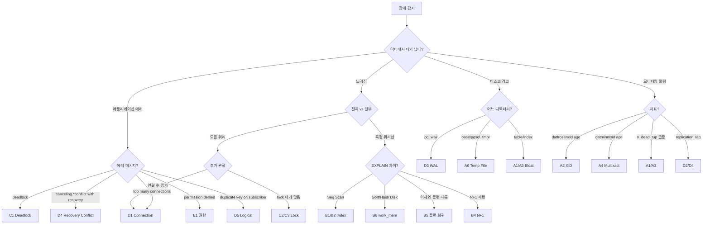

# troubleshooting — 장애 케이스 스터디

운영 중 마주치는 장애를 **증상 → 원인 → 진단 → 해결 → 예방** 5단계로 따라가는 케이스 모음. **27개 케이스 · 6개 카테고리**.

> 📘 전체 가이드 개요는 [../README.md](../README.md) 참고.

---

## 증상으로 빠르게 찾기

### Autovacuum / Bloat / Wraparound
| 증상 | 케이스 |
|------|--------|
| 테이블 크기가 계속 커지고 SELECT 느려짐 | [A1. Bloat 누적](A1_bloat_accumulation.md) |
| `database is not accepting commands` 경고 | [A2. XID Wraparound](A2_xid_wraparound.md) |
| Dead Tuple이 쌓이는데 VACUUM이 안 됨 | [A3. 긴 트랜잭션이 VACUUM 차단](A3_long_tx_blocks_vacuum.md) |
| `multixact members limit exceeded` 경고 | [A4. Multixact Wraparound](A4_multixact_wraparound.md) |
| 테이블은 멀쩡한데 인덱스만 비대 | [A5. 인덱스 단독 Bloat](A5_index_bloat.md) |
| 쿼리 실행 중 `pgsql_tmp/` 급증, 디스크 풀 | [A6. Temp File 디스크 풀](A6_temp_file_disk_full.md) |

### 쿼리
| 증상 | 케이스 |
|------|--------|
| 배포 후 갑자기 Seq Scan 폭주 | [B1. 인덱스 누락](B1_missing_index.md) |
| 인덱스가 있는데 Seq Scan | [B2. Seq Scan with Index](B2_seq_scan_with_index.md) |
| 조인 쿼리가 이상하게 느림, 중간 결과 폭증 | [B3. 잘못된 조인 순서](B3_bad_join_order.md) |
| 동일 패턴 쿼리가 수십·수백 번 실행됨 | [B4. N+1 쿼리](B4_n_plus_one.md) |
| 어제까진 빨랐는데 오늘 느려짐, 코드 변경 없음 | [B5. 플랜 회귀](B5_plan_regression.md) |
| EXPLAIN에 `Sort Method: external merge` 또는 `Hash batches: 256` | [B6. work_mem 부족/디스크 정렬](B6_work_mem_disk_sort.md) |
| psql에서는 빠른데 앱에서는 특정 값만 느림 | [B7. Prepared Statement 플랜 캐시 함정](B7_prepared_statement_trap.md) |

### Lock
| 증상 | 케이스 |
|------|--------|
| `ERROR: deadlock detected` | [C1. 데드락](C1_deadlock.md) |
| VACUUM 멈춤, `idle in transaction` 다수 | [C2. idle in transaction](C2_idle_in_transaction.md) |
| ALTER TABLE 배포 후 전체 서비스 지연 | [C3. DDL이 쿼리를 막는다](C3_ddl_blocking.md) |
| 자식 테이블 INSERT/UPDATE가 부모에 의해 대기 | [C4. FK 숨은 Share Lock](C4_fk_share_lock.md) |
| Advisory Lock이 세션 종료 후에도 남음 | [C5. Advisory Lock 누수](C5_advisory_lock_leak.md) |

### 운영 장애
| 증상 | 케이스 |
|------|--------|
| `FATAL: too many connections` | [D1. Connection 고갈](D1_connection_exhaustion.md) |
| Standby replay_lag 증가 | [D2. Replication Lag](D2_replication_lag.md) |
| `pg_wal/` 폭증, 디스크 풀 임박 | [D3. WAL 디스크 풀](D3_wal_disk_full.md) |
| Standby 쿼리가 `canceling statement due to conflict with recovery` | [D4. Recovery Conflict](D4_recovery_conflict.md) |
| Logical subscription apply lag / 고아 slot / UNIQUE 충돌 | [D5. Logical Replication 장애](D5_logical_replication_issues.md) |

### 보안 / 권한
| 증상 | 케이스 |
|------|--------|
| `permission denied for table`, 새 테이블마다 권한 누락 | [E1. 권한 오류 (GRANT/Default Privileges)](E1_permission_errors.md) |
| RLS 활성화 후 예상과 다른 결과, 소유자는 전부 보임 | [E2. RLS 정책 함정](E2_rls_policy_trap.md) |

### 업그레이드 / 클라우드
| 증상 | 케이스 |
|------|--------|
| `pg_upgrade` 실패, 업그레이드 후 쿼리 느림 | [F1. pg_upgrade 실패 시나리오](F1_pg_upgrade_failures.md) |
| `CREATE EXTENSION` 실패, `COPY FROM` 금지, SUPERUSER 부재 | [F2. 관리형 PostgreSQL 제약 (RDS/Aurora/Cloud SQL)](F2_managed_pg_limitations.md) |

---

## 카테고리별 상세

### A. Autovacuum / Bloat / Wraparound (6건)

MVCC와 VACUUM이 얽힌 장애. PostgreSQL의 가장 깊은 아픈 구멍.

| # | 케이스 | 핵심 포인트 |
|---|--------|-----------|
| [A1](A1_bloat_accumulation.md) | **Bloat 누적** | UPDATE-heavy + autovacuum 부적합 + 기본 fillfactor. `n_dead_tup`, `pgstattuple`, pg_repack |
| [A2](A2_xid_wraparound.md) | **XID Wraparound** | `datfrozenxid`, 2억/15억/20억 임계선, single-user 복구(전 DB 순회 + `template0`) |
| [A3](A3_long_tx_blocks_vacuum.md) | **긴 TX가 VACUUM 차단** | horizon/OldestXmin, `idle_in_transaction_session_timeout`, prepared xact, replication slot |
| [A4](A4_multixact_wraparound.md) | **Multixact Wraparound** | FK row-lock이 Multixact 소비, members/offsets 이중 임계, v14 failsafe |
| [A5](A5_index_bloat.md) | **인덱스 단독 Bloat** | B-tree leaf fragmentation, GIN pending list, `REINDEX CONCURRENTLY` (v12+) |
| [A6](A6_temp_file_disk_full.md) | **Temp File 디스크 풀** | `base/pgsql_tmp/`, work_mem 초과, `temp_file_limit`, `temp_tablespaces` 분리 |

관련 챕터: [ch03 MVCC](../chapters/ch03_mvcc.md) · [ch08 VACUUM](../chapters/ch08_vacuum_autovacuum.md)

### B. 쿼리 (7건)

인덱스와 플래너가 기대대로 동작하지 않는 상황들.

| # | 케이스 | 핵심 포인트 |
|---|--------|-----------|
| [B1](B1_missing_index.md) | **인덱스 누락** | 신규 WHERE 조건, 복합/부분/Covering, `CREATE INDEX CONCURRENTLY` |
| [B2](B2_seq_scan_with_index.md) | **Seq Scan with Index** | 함수 래핑, 타입 불일치, OR, 통계 오래됨, `random_page_cost` SSD 미튜닝 |
| [B3](B3_bad_join_order.md) | **잘못된 조인 순서** | 통계 오차, `CREATE STATISTICS`, `join_collapse_limit` |
| [B4](B4_n_plus_one.md) | **N+1 쿼리** | ORM Lazy loading, Eager/batch fetch, `IN` 절, LATERAL, DataLoader |
| [B5](B5_plan_regression.md) | **플랜 회귀** | ANALYZE 후/버전 업그레이드 후 플랜 변경, Extended Statistics, `EXPLAIN (GENERIC_PLAN)` v16+ |
| [B6](B6_work_mem_disk_sort.md) | **work_mem 부족** | external merge sort, Hash batch 분할, `hash_mem_multiplier` v13+ |
| [B7](B7_prepared_statement_trap.md) | **Prepared Statement 함정** | `plan_cache_mode` auto → 6회+ generic plan, pgBouncer tx mode 함정 |

관련 챕터: [ch05 인덱스](../chapters/ch05_indexes.md) · [ch06 플래너](../chapters/ch06_query_planner.md)

### C. Lock (5건)

| # | 케이스 | 핵심 포인트 |
|---|--------|-----------|
| [C1](C1_deadlock.md) | **Deadlock** | 잠금 순서 표준화, `SELECT FOR UPDATE` 순서, 재시도, `SKIP LOCKED` |
| [C2](C2_idle_in_transaction.md) | **idle in transaction** | OldestXmin 고정, `idle_in_transaction_session_timeout`, try/finally |
| [C3](C3_ddl_blocking.md) | **DDL이 쿼리를 막는다** | AccessExclusiveLock, `lock_timeout`, `CONCURRENTLY`, `NOT VALID → VALIDATE` |
| [C4](C4_fk_share_lock.md) | **FK 숨은 Share Lock** | 자식 INSERT/UPDATE → 부모 ForKeyShareLock, v9.3 전후 차이, FK 인덱스 누락 |
| [C5](C5_advisory_lock_leak.md) | **Advisory Lock 누수** | 세션 vs TX 스코프, OOM kill 후 유령 Lock, pgBouncer tx mode에서 재사용 혼선 |

관련 챕터: [ch07 트랜잭션과 Lock](../chapters/ch07_transactions_isolation.md)

### D. 운영 장애 (5건)

| # | 케이스 | 핵심 포인트 |
|---|--------|-----------|
| [D1](D1_connection_exhaustion.md) | **Connection 고갈** | `max_connections`, PgBouncer transaction mode |
| [D2](D2_replication_lag.md) | **Replication Lag** | write/flush/replay_lag 3단계, recovery conflict, `hot_standby_feedback` |
| [D3](D3_wal_disk_full.md) | **WAL 디스크 풀** | 고아 slot, `archive_command` 실패, `max_slot_wal_keep_size` 안전장치 |
| [D4](D4_recovery_conflict.md) | **Recovery Conflict** | Standby에서 6종 conflict, `max_standby_streaming_delay` vs `hot_standby_feedback` 트레이드오프 |
| [D5](D5_logical_replication_issues.md) | **Logical Replication 장애** | apply lag, UNIQUE 충돌, DDL drift, 고아 slot, v16+ parallel streaming |

관련 챕터: [ch09 WAL](../chapters/ch09_wal_checkpoint.md) · [ch10 Replication](../chapters/ch10_replication.md) · [ch14 모니터링](../chapters/ch14_monitoring_troubleshooting.md)

### E. 보안 / 권한 (2건)

| # | 케이스 | 핵심 포인트 |
|---|--------|-----------|
| [E1](E1_permission_errors.md) | **권한 오류** | `GRANT` 현재 객체에만, `ALTER DEFAULT PRIVILEGES` 필수, v15+ `public` 스키마 CREATE 권한 제거 |
| [E2](E2_rls_policy_trap.md) | **RLS 정책 함정** | `ENABLE` vs `FORCE`, 소유자 우회, `USING`/`WITH CHECK`, pgBouncer `SET` 상속, `pg_dump --no-row-security` |

관련 챕터: [ch02 아키텍처](../chapters/ch02_architecture.md) · [ch13 Extension](../chapters/ch13_extensions.md)

### F. 업그레이드 / 클라우드 (2건)

| # | 케이스 | 핵심 포인트 |
|---|--------|-----------|
| [F1](F1_pg_upgrade_failures.md) | **pg_upgrade 실패** | `--check` 필수, `--link`/`--copy`/`--clone` 트레이드오프, extension 라이브러리 부재, ANALYZE 누락 회귀 |
| [F2](F2_managed_pg_limitations.md) | **관리형 PG 제약** | `rds_superuser`/`cloudsqlsuperuser`/`azure_pg_admin`, 파일시스템 차단, extension 허용 목록, IOPS burst |

관련 챕터: [ch11 Backup](../chapters/ch11_backup_recovery.md) · [ch13 Extension](../chapters/ch13_extensions.md) · [version_history](../cheatsheets/version_history.md)

---

## 장애 대응 일반 원칙

```
1. 침착함 > 빠름 — 잘못된 DDL·VACUUM FULL·kill은 사태를 악화시킨다.
2. 진단 순서: 연결 수 → Lock → 긴 트랜잭션 → 쿼리 → 리소스 (WAL/디스크)
3. 로그 먼저 보기: log_lock_waits, log_checkpoints, log_min_duration_statement
4. "무엇이 빠르게 가역적인가"를 기준으로 조치 순서 정렬
5. 복구 후: 재발 방지 설정 · 모니터링 · 진단 쿼리를 워크북화
```

우선 실행해야 할 진단 쿼리는 [../cheatsheets/pg_stat_queries.md](../cheatsheets/pg_stat_queries.md)에 모아두었다.

---

## 증상 → 진단 → 조치 플로우



---

## 각 케이스의 구성

모든 케이스는 다음 포맷을 따른다.

- **증상 박스** — 한 줄 요약 + 지표 표
- **실제 상황 (재현 시나리오)** — 스키마, 데이터 규모, 타임라인
- **원인 분석** — "왜 그렇게 되는가" PG 내부 메커니즘 상세
- **진단 쿼리** — 복붙 가능한 `pg_stat_*`, `pg_locks`, `pg_replication_slots` 등
- **해결 방법** — 즉시 / 단기 / 근본 3단계
- **예방 원칙** — 체크리스트
- **Mermaid 다이어그램** — 문제 흐름 / 조치 순서
- **관련 챕터 / 치트시트 / 다른 케이스** — 상호 참조

---

## 관련 폴더

- [../chapters/](../chapters/) — 장애 근본 원리 이해
- [../cheatsheets/pg_stat_queries.md](../cheatsheets/pg_stat_queries.md) — 진단 쿼리 모음
- [../examples/](../examples/) — 예제에서 등장하는 운영 패턴
